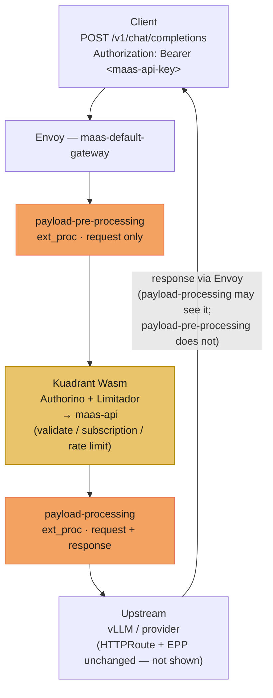
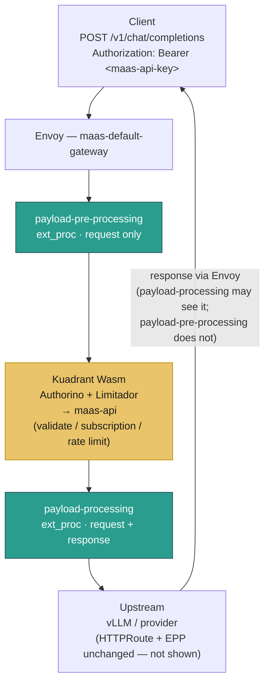
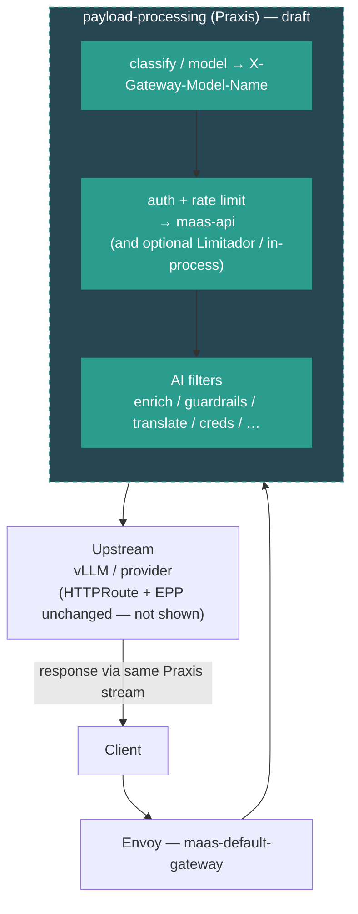

# Praxis dataplane evolution

How the MaaS AI Gateway **Envoy filter chain** evolves from IPP to Praxis.
This is a dataplane request-path map, not a deployment ADR — see
[DESIGN.md](../DESIGN.md) for operator / controller ownership.

Source notes:
[Praxis evolution (gist)](https://gist.github.com/aslakknutsen/ff7f9a7fc206b0706974a7756054e56d).

## Scope of these diagrams

Shown here:

- `payload-pre-processing` and `payload-processing` ext_proc filters
- Kuadrant (Authorino + Limitador) calling out to **maas-api**

Omitted on purpose (unchanged across these stages):

- **HTTPRoute match**
- **EPP / InferencePool scheduler** — stays exactly as it is today; it is
  **not** moving into Praxis

Color key:

| Color | Meaning |
| --- | --- |
| Orange | IPP-backed filter |
| Teal | Praxis-backed filter |
| Gold | Kuadrant (Authorino + Limitador → maas-api) — same pre-3.6 and 3.6 |

---

## Stages at a glance

| Stage | `payload-pre-processing` / `payload-processing` | Auth / rate limit | EPP |
| --- | --- | --- | --- |
| Current (pre-3.6) | IPP | Kuadrant → maas-api | Unchanged |
| Praxis for 3.6 | Praxis (same filter names / order) | Kuadrant → maas-api (same) | Unchanged |
| Post 3.6 | Praxis (draft) | Likely fold into Praxis (draft) | Unchanged |

---

## Current architecture (IPP)

**Filter roles (LLMISvc):**

1. **payload-pre-processing** — read body `model`, set `X-Gateway-Model-Name`
   (enough for model-scoped auth).
2. **Kuadrant** — Authorino + Limitador; calls **maas-api** for API-key
   validate / subscription select (and optional rate limit); inject
   `x-maas-*`; strip/replace client `Authorization`.
3. **payload-processing** — strip client/maas creds for upstream; rewrite
   `publishers/...` model when needed; response-path hooks as configured.

---

## Praxis for 3.6

Same Envoy filter **names and order**. Only the payload-processing
implementation switches from IPP to Praxis. Kuadrant → maas-api is unchanged.

**3.6 delta:** orange (IPP) → teal (Praxis) for the two payload filters.
Auth/RL path and EPP stay as today.

---

## Post 3.6 (initial draft — likely to change)

> **Draft only.** Direction of travel, not a committed design. Expect this
> section to change as Praxis / Kuadrant ownership is decided.

Idea under discussion: fold auth and rate limiting into the Praxis filter
pipeline so Kuadrant Wasm may leave the hot path. **EPP remains separate and
unchanged.**

---

## How this relates to this repository

| Concern | Owner today / 3.6 | Notes |
| --- | --- | --- |
| ExtProc install + ExternalModel control plane | `ai-gateway-controller` | Swaps IPP → Praxis behind the same filter names |
| Auth / subscription / API keys | Kuadrant → Authorino → **maas-api** | Same in pre-3.6 and 3.6; post-3.6 draft may fold into Praxis |
| Rate limits | Limitador via Kuadrant | Same story as auth |
| AI payload processing | IPP → Praxis | Color change in the diagrams above |
| InferencePool scheduling | **EPP** | **Out of scope — does not move into Praxis** |

For control-plane deployment topology (operators, tenant fan-out, IPP vs
Praxis selection), see [DESIGN.md](../DESIGN.md).
